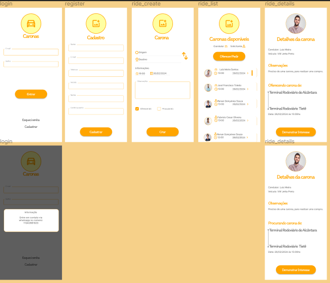

# 🚗 CaronasApp 🚗

Aplicativo para oferecer caronas de uma forma prática e rápida.




## 🚀 Tecnologias

- HTML
- CSS
- JavaScript
- Axios 
- Insomnia 
- React Native (Em breve)


##  🖌️ Layout no figma

##### Design das telas criado por: @viniciusbfonseca

```
https://www.figma.com/file/J2yY4lpAHLcCQauVNlCevb/Untitled?type=design&node-id=0-1&mode=design&t=GcvLSboknxD93X0F-0

```
## 💻 Instalação 

#### Instalação local usando o terminal de comandos:

1. Clone o repositório

```
git clone https://github.com/rayane-araujo/caronas-app

```

2. Vá até o repositório clonado

```
cd caronas-app

```

3. Instale as dependências

```
npm install 

```

4. Execute o app

<strong>OBS:</strong> Antes entre na pasta api digitando <strong>cd api</strong> e em seguinda rode o comando:

```
npm run dev

``` 


